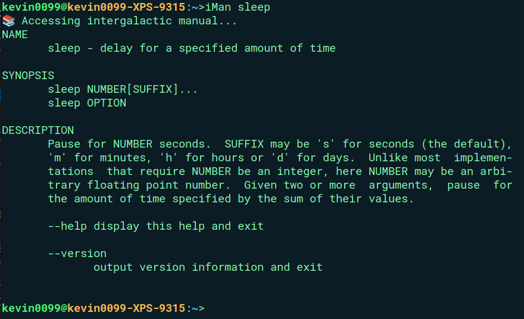

# 🚀 CosmoShell: Your Gateway to the Command Universe

### Welcome to CosmoShell, where the command line meets the cosmos! 🌌

## 🌟 Introduction

Embark on an interstellar journey through your system with CosmoShell, a custom-built shell that turns mundane tasks into cosmic adventures. Whether you're a seasoned space commander or a rookie astronaut, CosmoShell offers a unique blend of power and simplicity that will make you feel like you're piloting a starship through the digital universe of your Operating System!!

## 🚀 Launching Your Cosmic Adventure

### 🛰️ Pre-flight Checklist
Before embarking on your cosmic journey, ensure your starship is equipped with:
* A C compiler (your universal translator for cosmic code)

### 🏗️ Constructing Your Starship

1. Clone the cosmic blueprints:
    ```bash
   git clone https://github.com/theculguy0099/CosmoShell.git
   cd CosmoShell
2. 🚀 Igniting the Cosmic Engines:
    ```bash
     make
    ./a.out
### 🌠 Entering the Cosmos

As your starship comes to life, you'll be greeted by the cosmic prompt, your launchpad for every command:

```bash
<Username@SystemName:~> 
```


You are now ready to navigate the digital universe! Use the commands detailed in the "Features" section to explore your system like never before.

Remember, young astronaut: in the vast expanse of CosmoShell, every directory is a new solar system, every file is a star waiting to be discovered. Your journey through the command line cosmos begins now!

### 🌌 Ad astra per codica! (To the stars through code!)


# 🛸 Features

## 1. 🔗 Command Chaining (`;` separated commands)

### <span style="color:#FFD700;"><strong>  "Chain your commands like</strong></span> <span style="color:#1E90FF;"><strong>constellations</strong></span> <span style="color:#FFFFFF;"><strong>in the night sky!"</strong></span>


* Execute multiple commands in a single line by separating them with a semicolon `;`
* Example: `ls; echo "Hello, Space!"; hostname`
* **Note**: The shell supports flexible whitespace in command input. Commands can be entered with any number of spaces or tabs between arguments, flags, and operators. The shell will parse and execute these commands correctly, regardless of the amount of whitespace used.
---

## 2.  🌠  Background Processes (`&` terminated commands)
### <span style="color:#32CD32;"><strong>"Launch processes into the</strong></span> <span style="color:#9370DB;"><strong>cosmic background</strong></span><span style="color:#FFFFFF;"><strong>, where they orbit silently!"</strong></span>


* Run processes in the background by appending an ampersand `&` at the end of the command.
* Example: `vim &`

#### Process ID Display
* CosmoShell displays the PID of background processes before executing them.
* Example: `[1] 35006`

#### Background Process Monitoring
* CosmoShell reports the status of background processes when they are:
  - Completed
  - Suspended
  - Resumed

* **Example**: **Running `sleep` in the background and `echo` in the foreground:**
    ```sh
    sleep 5 &     echo     "Welcome to Cosmic World!"
    ```

    - **Explanation:**
        - `sleep 5 &` runs the `sleep` command in the background for 5 seconds.
        - `&` symbol is used to run the command in the background.
        - `echo "Welcome to Cosmic World!"` runs immediately in the foreground, immediately printing "`Welcome to Cosmic World!`".

    - **Output:**
        ```sh
        [2] 35036
        Welcome to Cosmic World!
        ```
        - `[2] 35036` indicates that the background job has been started with job number 2 and process ID 35036.
        - After 5 seconds, the shell reports that the Child process with PID 103894 exited normally with process_status 0.
---

## 3. 🌀 Warp Command
### <span style="color:#FF4500;"><strong>"Traverse the file system at warp speed</strong></span><span style="color:#1E90FF;"><strong>, bending space-time to your will!"</strong></span>


#### Usage: `warp [DIR]`
```sh

warp test
warp assignment
warp ~
warp -
warp .. test
```
- Here, `[DIR]` can take on any of the following values
  - `~` Changes directory to the home directory i.e. the directory from which the shell was executed
  - `-` Changes directory to the previous working directory
  - `..` Changes directory to the previous directory in the absolute path of the current directory from home.
  - `.. [DIR]` Changes directory accordingly by  executing 'warp' for both.
  - Any `relative path` from the home directory is valid
  - Any `absolute path` (i.e. from the root directory) is valid
  - Passing no arguments changes directory to the home directory
  - Note that these are valid as long as the user has the appropriate permissions for the directory passed.
---

## 4. 🔭 Peek Command
### <span style="color:#00CED1;"><strong>"Gaze upon the celestial bodies</strong></span> <span style="color:#FFD700;"><strong>in your cosmic neighborhood!"</strong></span>


### Usage : `peek [OPTIONS]... [DIR]...`
```bash
peek . 
peek test
peek -a
peek -l
peek -a directory
peek -l directory
peek -a -l directory
```

- Here, `[OPTIONS]` can take any of the following values
  - Specifying no options and just `.` prints only the names of the non-hidden files/folders from the FILEs passed(if any, else current directory files/folders are printed)
  - `-a` (all) Behaves similar to no options but additionally prints hidden files
  - `-l` (long format) Prints additional info such as permissions, date modified, size for each non-hidden file
    - Differentiates file types with color coding (green for executables, white for files, and blue for directories).
  - Note that multiple options can be used at the same time
- The `[DIR]` argument can be
  - A relative or absolute path to a folder
  - Note that the user is required to have appropriate permissions to read the details/contents of the folder.
---

## 5. 📜 Pastevents Command
### <span style="color:#7CFC00;"><strong>"Access your commands history</strong></span> <span style="color:#DAA520;"><strong>like a cosmic ledger!"</strong></span>


- Displays the previous 14 commands executed on the Terminal
### Usage : `pastevents execute [0<=index<=14]`
```bash
pastevents
pastevents execute 3
pastevents purge
```
- Here, specifying only pastevents, will print previous 14 commands and are stored in ***history.txt***
- If the new command entered is same as any of ***previous*** commands, then it will not be stored in history.txt
- ***pastevents purge*** clears history.txt file
- ***pastevents execute index*** will Execute the recently appended command at that index in history.txt file.
### Fun Fact: If history.txt looks like :
```bash
warp test; pastevents execute 4
warp .. 
pastevents execute 5
pastevents execute 3
pastevents execute 2
```
- Here, if command provided is `pastevents execeute 1`, then it will first execute recent command, then second recent , then third recent , then fifth recent , i.e. `warp test`(will change the directory to ~/test) and then will execute `pastevents execute 4` , i.e. `warp ..` and will return to the previous directory in that absolute path.
---

## 6. 🔍 Seek Command
### <span style="color:#00BFFF;"><strong>"Uncover hidden cosmic treasures</strong></span> <span style="color:#FF4500;"><strong>in the vast expanse of your file system!"</strong></span>

### Usage : `seek <flags> <search> <target_directory>`
- Flags : 
    - -d : Only look for directories (ignore files even if name matches)
    - -f : Only look for files (ignore directories even if name matches)
    - -d and -f flag can’t be used at the same time.
    - If No flags are given, then it will look for both files and directory
    - -e : This flag is effective only when a single file or a single directory with the name is found. If only one file (and no directories) is found, then print it’s output. If only one directory (and no files) is found, then change current working directory to it
- Search : 
    - Write the file or directory that needs to be searched inside the `<target_directory>` tree
- target_directory :
    - Write the folder in whose the file or folder is to be printed

- `No match found!` will be printed in case no matching files/directories is found.
- It returns a list of relative paths (from target directory) of all matching files/directories (files in green and directories in blue) separated with a newline character.
- For Example:
    ```
    seek -f sample.txt test
    seek -d test1 test
    seek -e test1 test
    seek -e iman.c .
    ```
---
## 7. 🌍  System Commands
### <span style="color:#FFA500;"><strong>"Harness</strong></span> <span style="color:#9932CC;"><strong>the power</strong></span> <span style="color:#00FF00;"><strong>of your home planet's native commands!"</strong></span>

- The shell executes system commands both in the foreground and background. It captures and displays the process ID (PID) of background processes.
- You can also run the routine commands of a Linux Terminal.
- For Example:
    ```
    ls
    sleep 5 &
    echo "CosmoShell!"
    git status
    pwd
    cat history.txt
    ```
---
## 8. 👁️ Proclore Command
### <span style="color:#1E90FF;"><strong>"Analyze the vital signs</strong></span> <span style="color:#FF6347;"><strong>of your cosmic with processes!"</strong></span>
### Usage : `proclore [pid]`

- Displays the pid, process status(R/R+/S/S+/Z),Process Group, memory consumption and executable path for the specified process
- If no arguments are passed, it displays the info related to the current **Terminal** process
```bash
proclore
proclore 109581
```

``` 
kevin0099@kevin0099-XPS-9315:~>proclore
📊 Analyzing ship's systems...
pid: 108419
process Status: R+
Process Group: 108419
Virtual Memory: VmSize:	  996660 kB
executable Path: /home/kevin0099/CosmosShell/a.out
```
- Passing a valid `pid` displays the info related to the specified `pid`
```
kevin0099@kevin0099-XPS-9315:~>sleep 15 &
🖥️ Interfacing with starship mainframe: sleep
child with pid [109581] sent to background
```
```
kevin0099@kevin0099-XPS-9315:~>proclore 109581
📊 Analyzing ship's systems...
pid: 109581
process Status: S+
Process Group: 109581
Virtual Memory: VmSize:	    8372 kB
executable Path: /usr/bin/sleep
```
---
## 9. 📡 I/O Redirection
### <span style="color:#9400D3;"><strong>"Channel the cosmic energies</strong></span> <span style="color:#FF8C00;"><strong>of input and output across dimensions!"</strong></span>

- `<` `[FILE]` can be used to redirect input from the specified `[FILE]` for a command

-   `>` `[FILE]` and `>>` `[FILE]` can be used to redirect the output to the specified [FILE] for a command. > `Overwrites` the output file and >> `appends` to the output file

- Both input and output redirections can be used on a single command
- For Example:
    ```
    cat < input.txt > output.txt
    ```
---
## 10. 🎛️ Piping
### <span style="color:#FF1493;"><strong>Create intricate networks</strong></span> <span style="color:#FFD700;"><strong>of data flow, like cosmic highways!</strong></span>


- `<command> | <command>` can be used to pipe the output of the command on the left side of the pipe to the command on the right side of the pipe

- Two or more commands can be chained together by piping
- Piping can be used alongside input and output redirections
- For Example:
    ```
    cat < in.txt | wc -l > lines.txt
    ```

### Fun Fact : 
-   In case of a conflict between taking input/output from the pipe or through a redirection, the `redirection is given higher preference`.
- For Example:
    ```
    cat in.txt | sort > out.txt | wc -l
    ```
    - This will output `0` since the sort command redirects the output to out.txt and not the pipe

---
## 11. 🌠 Activities
### <span style="color:#1E90FF;"><strong>Monitor your fleet</strong></span> <span style="color:#FFA500;"><strong>of processes as they sail through the digital cosmos!</strong></span>


- `activities` print a list of all the processes currently running that were spawned by shell in ***lexicographic*** order.
- This list will contain the following information about all processes :
  - Command Name
  - pid
  - state : running, stopped and finished

- If a process is ***finished***, then it will be printed only once. 
```bash
activities
```
```
 110638 sleep 15 Running
 110640 echo CosmoShell finished
 110641 sleep 20 Stopped
```
---
## 12. 🔊 Signals
### <span style="color:#9932CC;"><strong>Communicate with your processes</strong></span> <span style="color:#32CD32;"><strong>using quantum entanglement!</strong></span>


- Following 3 commands are direct keyboard input where Ctrl is Control key on keyboard (or it’s equivalent).

    #### `Ctrl - C`

    - Interrupt any currently running foreground process by sending it the SIGINT signal. It has no effect if no foreground process is currently running.

    #### `Ctrl - D`

    - Log out of your shell (after killing all processes) while having no effect on the actual terminal.

    #### `Ctrl - Z`

    - Push the (if any) running foreground process to the background and change it’s state from “Running” to “Stopped”. It has no effect on the shell if no foreground process is running.
---
## 13. 📡 Ping:
### <span style="color:#4169E1;"><strong>Send cosmic signals</strong></span> <span style="color:#FF1493;"><strong>to distant processes in your galaxy!</strong></span>


### Usage : `ping [pid] [signal_number]`

The pid can be any of the pids listed using the command `activities`

The signal_number can be any of the signals listed under the manpage signal(7)
```
ping [PID] 9
ping [PID] 20
ping [PID] 18
```
- Signal Number 9 is used to send the SIGKILL signal (terminate immediately) to a process with a specific PID.
- Signal Number 20 is used to send the SIGSTOP signal (pause the process) to a process with a specific PID.
- Signal Number 18 is used to send the SIGCONT signal (continue the process if it is currently stopped) to a process with a specific PID.
---

## 14. 🚀 fg and bg:
### <span style="color:#8A2BE2;"><strong>Summon processes from the cosmic background</strong></span> <span style="color:#4682B4;"><strong>or send them on stealth missions!</strong></span>


- fg - Brings the running or stopped process specified by the pid to the foreground.
- bg - Sends the running or stopped process specified by the pid to the background
### Usage: 
`fg [pid]`

`bg [pid]`

```
fg 110641
bg 110636
```
The pid can be any of the pids listed using the command `activities`.
---

## 15. 👶  Neonate:
### <span style="color:#FF00FF;"><strong>Witness the birth of new processes</strong></span> <span style="color:#00CED1;"><strong>in the cosmic nursery!</strong></span>

```
neonate -n 4
```
### Usage: `neonate [OPTION] N`

- Here, the `[OPTION]` must include exactly one instance of
  - `-n` followed by a positive integer `[N > 0]` which specifies the interval for printing the command output
  - This prints the PID of the most recently created process on the system after every `N` seconds
- A keypress of `x` stops execution of the command 
---

## 16. 📚 iMan: Intergalactic Manual
### <span style="color:#8B008B;"><strong>Access the wisdom of the universe</strong></span> <span style="color:#20B2AA;"><strong>through the cosmic library!</strong></span>

```
iMan sleep
iMan ls
iMan grep
```
- The iMan command fetches and displays man pages from http://man.he.net/. It accepts a command name as an argument and retrieves the corresponding man page.
- For Example:

    - 
---

## 17. 🌑 Finish 
### <span style="color:#FFFF00;"><strong>Conclude your cosmic journey</strong></span> <span style="color:#00FF00;"><strong>and return to Earth!</strong></span>

- Exits out of the shell
```
finish
``` 
---

# 🌟 Assumptions
1. Assuming the input size will be maximum of 1024 bytes.
2. Each command is less than ***1000 characters***.
3. All paths involved are less than ***1000 characters***.
4. In the pastevents command, if the command contains pastevents, then it wont be stored in history.txt, or else the corresponding command will be check with the last command and if both of them are not same, then they are stored in ***history.txt***.
5. In the proclore command if the pid given corresponds to a system command then run as a sudo user.
5. The history is stored in a `.txt` file located in the directory where the executable resides.
---
